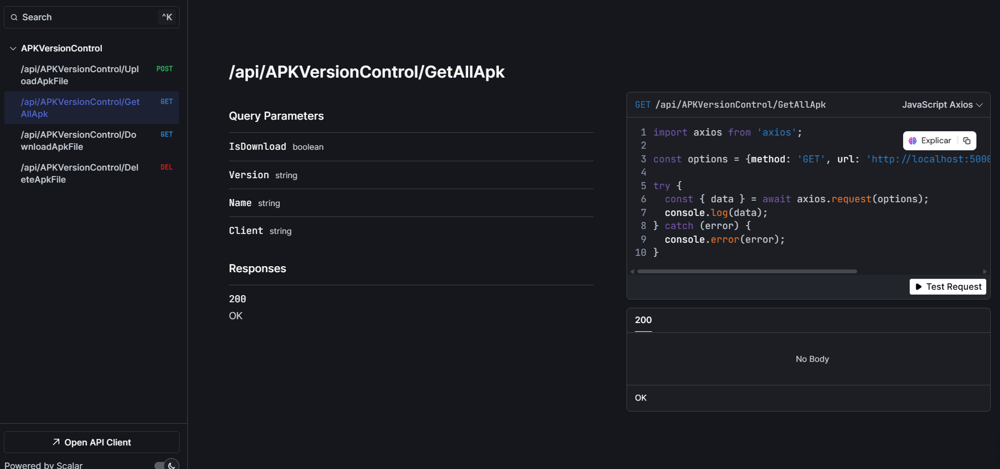

# API de Gestión de Archivos APK



Esta API está diseñada para gestionar y administrar archivos APK, permitiendo a los usuarios obtener información detallada sobre ellos, como la versión, el nombre y otros metadatos. La API utiliza:

- **SQLite** como base de datos para almacenar los registros de los archivos APK.
- **Entity Framework Core** para la gestión de datos.
- **Java** y la librería **AXMLPrinter2.jar** para extraer la información de los archivos APK y presentarla en formato JSON.


## Requisitos Previos

Para que la API funcione correctamente, es necesario tener instalado:

- **.NET SDK**: Asegúrate de tener .NET 9 o superior instalado en tu sistema. Puedes verificar la versión de .NET ejecutando el siguiente comando en tu terminal:
  ```bash
  dotnet --version
  ```


- **SQLite**: La base de datos SQLite se creará automáticamente al ejecutar la aplicación. No es necesario instalar SQLite manualmente.

## Estructura del Proyecto

El proyecto tiene la siguiente estructura de carpetas:

```
/proyecto
│
├── /Controllers
│   └── APKVersionControlController.cs
│
├── /Entity
│   └── ApkFile.cs
│
├── /Infrastructure
│   ├── SqlLiteContext.cs
│   └── /Repository
│       └── ApkRepository.cs
│
├── /Interfaces
│   ├── IRepository.cs
│   └── IServices.cs
│
├── /Services
│   └── APKVersionControlServices.cs
│
├── /wwwroot
│   └── /Files
│       └── (Archivos APK almacenados)
│
├── appsettings.json
├── Program.cs
└── README.md
```

## Configuración de la Base de Datos

La API utiliza **SQLite** como base de datos. El archivo de la base de datos se creará automáticamente en la carpeta `LocalApplicationData` del sistema.


## Creación de la Carpeta `wwwroot`

La carpeta `wwwroot` es un directorio esencial en el proyecto, ya que es donde se almacenan los archivos APK que se suben a través de la API.

### ¿Por qué es necesaria la carpeta `wwwroot`?

- **Almacenamiento de Archivos**: La carpeta `wwwroot` actúa como el directorio raíz para el almacenamiento de archivos estáticos, como los archivos APK. Dentro de esta carpeta, se crea una subcarpeta llamada `Files` donde se guardan los archivos APK.
  
- **Organización de Archivos**: Si un archivo APK está asociado a un cliente específico, se crea una subcarpeta dentro de `Files` con el nombre del cliente en minúsculas. Esto permite una organización clara y jerárquica de los archivos.

### Creación Automática de la Carpeta `wwwroot`

La API está diseñada para crear automáticamente la carpeta `wwwroot` y su subcarpeta `Files` al iniciarse por primera vez. Esto se hace mediante un código que verifica la existencia de la carpeta y la crea si no existe. Asegúrate de que la aplicación tenga permisos de escritura en el directorio donde se ejecuta para que este proceso funcione correctamente.

Si la carpeta no se crea automáticamente, puedes crearla manualmente siguiendo estos pasos:

1. Navega a la raíz del proyecto.
2. Crea una carpeta llamada `wwwroot`.
3. Dentro de `wwwroot`, crea una subcarpeta llamada `Files`.

La estructura final debería verse así:

```
/proyecto
│
├── /wwwroot
│   └── /Files
│       └── (Archivos APK almacenados)
│
└── ...
```

## Funcionalidades Principales

1. **Subida de Archivos APK**: Permite subir archivos APK y almacenarlos en la carpeta `wwwroot/Files`. Los archivos pueden estar asociados a un cliente específico.

2. **Extracción de Metadatos de APK**: La API utiliza `AXMLPrinter2.jar`  para extraer información como el nombre, la versión, y otros detalles de los archivos APK.es de los archivos APK.

3. **Almacenamiento en SQLite**: Guarda los metadatos de los archivos APK en una base de datos SQLite.

4. **Descarga de Archivos APK**: Permite descargar un archivo APK específico utilizando el nombre del archivo y la versión.

5. **Eliminación de Archivos APK**: Permite eliminar un archivo APK específico utilizando el nombre del archivo y la versión.

6. **Búsqueda de Archivos APK**: Permite buscar archivos APK por nombre, versión y cliente.

7. **Job de Limpieza Automática**: Incluye un job programado que elimina automáticamente los archivos APK con más de dos meses de antigüedad.

## Uso de la API

### Insertar un Archivo APK

Para insertar un archivo APK en la API, sigue estos pasos:

1. **Subir el Archivo APK**: Envía el archivo APK a la API mediante una solicitud HTTP POST.
2. **Especificar Parámetros**: Puedes especificar parámetros como `Client`, el cual es un parámetro opcional que representa al cliente al que pertenecerá la APK en la solicitud. Si no se proporciona el parámetro `Client`, la APK no estará asociada a ningún cliente en específico y se guardará de forma general.
3. **Respuesta**: La API devolverá un JSON con un mensaje indicando que se ha guardado el archivo. En caso contrario, lanzará una excepción.

### Obtener Información de un APK

Para obtener información sobre un archivo APK específico, realiza una solicitud HTTP GET con los parámetros `name`, `version`, y `client`.

**Ejemplo de solicitud:**
```http
GET /api/APKVersionControl/GetAllApk?name=apk_mobil&version=18.67&client=x
```

**Respuesta:**
```json
{
    "Name": "apk_mobil",
    "Size": 95.36,
    "Version": "18.67",
    "CreatedAt": "2025-01-23T14:17:40.0229912-04:00",
    "IsCurrentVersion": true,
    "IsPreviousVersion": false,
    "Client": "x"
}
```

### Descargar un Archivo APK

Para descargar un archivo APK específico, realiza una solicitud HTTP GET al endpoint correspondiente con los parámetros `name`, `version`, y `isDownload=true`.

**Ejemplo de solicitud:**
```http
GET /api/APKVersionControl/DownloadApkFile?name=apk_mobil&version=18.67&isDownload=true
```

**Respuesta:**
- Si el archivo existe, se devolverá el archivo APK para su descarga.
- Si el archivo no existe, se devolverá un código de estado 404 (No encontrado).

### Eliminar un Archivo APK

Para eliminar un archivo APK específico, realiza una solicitud HTTP DELETE al endpoint correspondiente con los parámetros `name` y `version`.

**Ejemplo de solicitud:**
```http
DELETE /api/APKVersionControl/DeleteApkFile?name=apk_mobil&version=18.67
```

**Respuesta:**
- Si el archivo existe y se elimina correctamente, se devolverá un mensaje de éxito.
- Si el archivo no existe, se devolverá un código de estado 404 (No encontrado).

## Límite de Subida de Archivos APK

La API tiene un límite de subida de archivos APK de **2 GB**. Si necesitas cambiar este límite, puedes hacerlo modificando la configuración en el archivo de configuración de la API. Para ello, agrega o modifica la siguiente línea en tu configuración:

```csharp
builder.Services.ConfigureMaxRequestBodySize(2L * 1024 * 1024 * 1024); // 2 GB
```

Puedes ajustar el valor según tus necesidades. Por ejemplo, si deseas aumentar el límite a 5 GB, cambia el valor a:

```csharp
builder.Services.ConfigureMaxRequestBodySize(5L * 1024 * 1024 * 1024); // 5 GB
```

## Ejemplo de Respuesta JSON

```json
{
    "Name": "apk_mobil",
    "Size": 95.36,
    "Version": "18.67",
    "CreatedAt": "2025-01-23T14:17:40.0229912-04:00",
    "IsCurrentVersion": true,
    "IsPreviousVersion": false,
    "Client": "x"
}
```

## Configuración

No se requiere configuración adicional más allá de tener .NET SDK instalado. La base de datos SQLite se creará automáticamente al ejecutar la aplicación.

---
